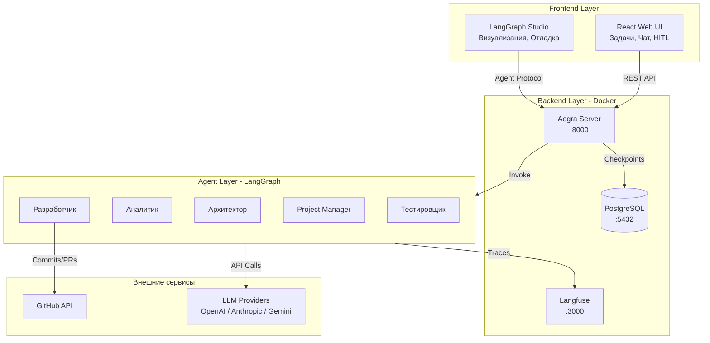
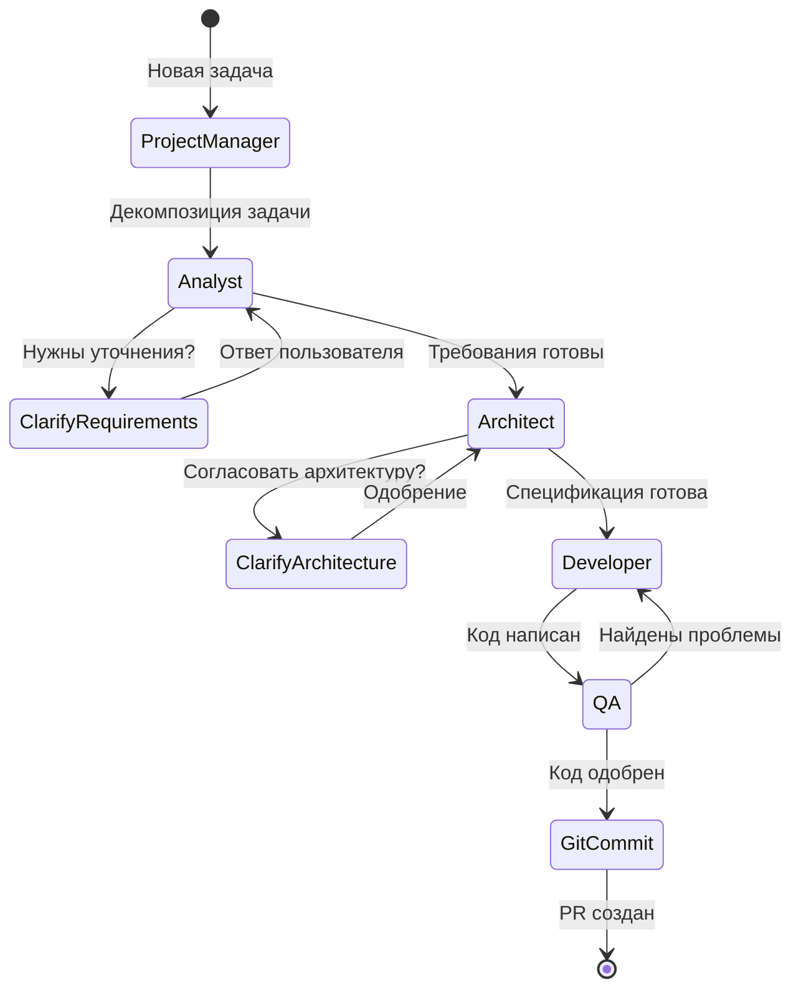

# AI-crew: Архитектура мультиагентной платформы разработки

## Обзор

AI-crew — это self-hosted платформа, где команда ИИ-агентов (аналитики, архитекторы, менеджеры, разработчики) совместно создают приложения. Система построена на LangGraph для оркестрации агентов и Aegra для развёртывания.

## Содержание

1. [Стек технологий](#стек-технологий)
2. [Архитектура системы](#архитектура-системы)
3. [Компоненты](#компоненты)
4. [Структура агентов](#структура-агентов)
5. [Human-in-the-Loop](#human-in-the-loop)
6. [Инструменты агентов](#инструменты-агентов)
7. [Структура проекта](#структура-проекта)
8. [Развёртывание](#развёртывание)
9. [Фазы разработки](#фазы-разработки)

---

## Стек технологий

| Компонент | Технология | Назначение |
|-----------|------------|------------|
| Оркестрация агентов | **LangGraph** | Графы агентов, state management, условные переходы |
| Backend/API | **Aegra** (FastAPI) | Agent Protocol, REST API, PostgreSQL checkpointing |
| Визуализация/Отладка | **LangGraph Studio** | Визуализация графа, Time Travel, редактор промптов |
| Observability | **Langfuse** | Трейсинг, стоимость токенов, оценка качества |
| Web UI | **React** (Vite) | Постановка задач, чат, Human-in-the-Loop |
| База данных | **PostgreSQL** | Checkpoints, состояния, история диалогов |
| LLM | **Multi-provider** | OpenAI, Anthropic, Google, Open-source (через LiteLLM) |
| Деплой | **Docker Compose** | Self-hosted развёртывание |

### Почему этот стек?

- **LangGraph** — гибкая оркестрация с циклами, условиями и human-in-the-loop
- **Aegra** — бесплатная self-hosted альтернатива LangGraph Platform с полной совместимостью
- **LangGraph Studio** — готовый UI для визуализации и отладки (подключается к Aegra через Agent Protocol)
- **Langfuse** — open-source observability, важно для отладки мультиагентных систем

---

## Архитектура системы



### Потоки данных

1. **Пользователь → Web UI → Aegra** — постановка задачи, ответы на вопросы
2. **Aegra → LangGraph** — запуск/продолжение графа агентов
3. **Агенты → LLM Providers** — генерация ответов
4. **Агенты → GitHub** — коммиты и PR
5. **Агенты → Langfuse** — логирование для отладки
6. **LangGraph Studio → Aegra** — визуализация и отладка

---

## Компоненты

### 1. Aegra Server

Aegra — это open-source бэкенд, совместимый с LangGraph Platform API.

**Ключевые возможности:**
- REST API для управления threads, runs, assistants
- Agent Protocol для подключения LangGraph Studio
- PostgreSQL для персистентности (checkpoints)
- Streaming responses
- Human-in-the-loop через механизм interrupts

**Конфигурация:** `aegra.json`
```json
{
  "graphs": {
    "dev_team": "./graphs/dev_team/graph.py:graph"
  },
  "http": {
    "cors": {
      "allow_origins": ["http://localhost:5173"],
      "allow_credentials": true
    }
  }
}
```

### 2. Web UI (React)

Минималистичный интерфейс для конечных пользователей:

- **Создание задачи** — форма с описанием, контекстом, целевым репозиторием
- **Чат-интерфейс** — общение с агентами в реальном времени
- **Панель HITL** — отображение и ответы на уточняющие вопросы
- **Прогресс** — визуализация текущего этапа выполнения
- **История** — архив задач и результатов

### 3. LangGraph Studio

Используется для:
- Визуализации структуры графа агентов
- Пошаговой отладки (step-by-step execution)
- Time Travel — откат к любому состоянию
- Редактирования промптов и конфигураций
- Изменения State на лету для тестирования

**Подключение к Aegra:**
```
Base URL: http://localhost:8000
```

### 4. Langfuse

Observability платформа для:
- Трейсинга всех LLM-вызовов
- Подсчёта стоимости токенов
- Оценки качества ответов агентов
- Отладки сложных мультиагентных сценариев

---

## Структура агентов

### Граф выполнения



### Роли агентов

| Агент | Рекомендуемый LLM | Задачи |
|-------|-------------------|--------|
| **Project Manager** | GPT-4o | Приём и декомпозиция задач, контроль прогресса, финальная валидация |
| **Аналитик** | Claude 3.5 Sonnet | Сбор и уточнение требований, написание user stories, acceptance criteria |
| **Архитектор** | Claude 3.5 Sonnet | Проектирование системы, выбор технологий, определение структуры |
| **Разработчик** | GPT-4o / Codestral | Написание кода, рефакторинг, исправление багов |
| **Тестировщик** | GPT-4o-mini | Code review, написание тестов, проверка качества |

### State модель

```python
from typing import TypedDict, Annotated
from langgraph.graph.message import add_messages

class DevTeamState(TypedDict):
    # Входные данные
    task: str                           # Описание задачи
    repository: str                     # URL GitHub репозитория
    
    # Промежуточные результаты
    requirements: list[str]             # Список требований
    user_stories: list[dict]            # User stories от аналитика
    architecture: dict                  # Архитектурное решение
    
    # Код и артефакты
    code_files: list[dict]              # Сгенерированные файлы
    test_results: dict                  # Результаты тестов
    review_comments: list[str]          # Комментарии ревью
    
    # Результат
    pr_url: str                         # URL созданного PR
    
    # История общения
    messages: Annotated[list, add_messages]
    
    # Метаданные
    current_agent: str                  # Текущий активный агент
    clarification_needed: bool          # Флаг для HITL
    clarification_question: str         # Вопрос для пользователя
```

---

## Human-in-the-Loop

### Механизм работы

LangGraph поддерживает прерывания (interrupts) для получения ввода от пользователя:

```python
from langgraph.checkpoint.postgres import PostgresSaver

# Граф с interrupt перед clarification
graph.add_node("clarification", clarification_node)
graph = graph.compile(
    checkpointer=PostgresSaver(conn_string),
    interrupt_before=["clarification"]
)
```

### Сценарии HITL

1. **Уточнение требований** (Аналитик)
   - Агент формулирует вопрос
   - Граф приостанавливается
   - Пользователь отвечает через Web UI
   - Граф продолжается с обновлённым state

2. **Согласование архитектуры** (Архитектор)
   - Архитектор предлагает решение
   - Пользователь одобряет или корректирует
   - После одобрения переход к разработке

3. **Критичные решения** (любой агент)
   - При обнаружении неоднозначности
   - При необходимости доступа к конфиденциальным данным
   - При отклонении от первоначального плана

### API для HITL

```python
# Получение состояния приостановленного графа
GET /threads/{thread_id}/state

# Отправка ответа пользователя
POST /threads/{thread_id}/runs/{run_id}/resume
{
    "input": {
        "clarification_response": "Ответ пользователя"
    }
}
```

---

## Инструменты агентов

### GitHubTool

```python
from langchain_community.tools import GitHubToolkit

# Возможности:
# - Создание веток
# - Коммит файлов
# - Создание Pull Request
# - Чтение существующего кода
# - Комментирование PR
```

### FileSystemTool

```python
from langchain_community.tools import FileManagementToolkit

# Возможности:
# - Чтение файлов проекта
# - Запись новых файлов
# - Модификация существующих
# - Работа с директориями
```

### CodeExecutionTool

```python
# Возможности:
# - Запуск тестов
# - Линтинг кода
# - Проверка типов
# - Выполнение скриптов
```

### SearchTool

```python
# Возможности:
# - Поиск по документации
# - Поиск в кодовой базе
# - Поиск в интернете (опционально)
```

---

## Структура проекта

```
AI-crew/
├── aegra.json              # Конфигурация Aegra (графы, CORS)
├── docker-compose.yml      # Docker инфраструктура
├── .env                    # Переменные окружения (секреты)
├── .env.example            # Пример переменных
├── requirements.txt        # Python зависимости
│
├── graphs/                 # LangGraph агенты
│   └── dev_team/
│       ├── __init__.py
│       ├── graph.py        # Основной граф команды
│       ├── state.py        # Определение State
│       ├── agents/         # Определения агентов
│       │   ├── __init__.py
│       │   ├── pm.py           # Project Manager
│       │   ├── analyst.py      # Аналитик
│       │   ├── architect.py    # Архитектор
│       │   ├── developer.py    # Разработчик
│       │   └── qa.py           # Тестировщик
│       ├── tools/          # Инструменты агентов
│       │   ├── __init__.py
│       │   ├── github.py       # GitHub интеграция
│       │   ├── filesystem.py   # Работа с файлами
│       │   └── code_exec.py    # Выполнение кода
│       └── prompts/        # Промпты агентов (YAML)
│           ├── pm.yaml
│           ├── analyst.yaml
│           ├── architect.yaml
│           ├── developer.yaml
│           └── qa.yaml
│
├── frontend/               # React Web UI
│   ├── src/
│   │   ├── components/     # UI компоненты
│   │   │   ├── Chat.tsx
│   │   │   ├── TaskForm.tsx
│   │   │   ├── ProgressTracker.tsx
│   │   │   └── ClarificationPanel.tsx
│   │   ├── pages/          # Страницы
│   │   │   ├── Home.tsx
│   │   │   └── TaskDetail.tsx
│   │   ├── api/            # API клиент
│   │   │   └── aegra.ts
│   │   ├── hooks/          # React hooks
│   │   ├── types/          # TypeScript типы
│   │   ├── App.tsx
│   │   └── main.tsx
│   ├── package.json
│   ├── vite.config.ts
│   └── tailwind.config.js
│
├── docs/                   # Документация
│   ├── architecture.md     # Этот файл
│   ├── deployment.md       # Инструкция по развёртыванию
│   └── agents.md           # Детальное описание агентов
│
└── scripts/                # Утилиты
    ├── setup.sh            # Скрипт инициализации
    └── seed_prompts.py     # Загрузка промптов
```

---

## Развёртывание

### Требования

- Docker & Docker Compose
- Node.js 18+ (для frontend)
- API ключи: OpenAI, Anthropic (опционально: Google, Langfuse)

### Быстрый старт

```bash
# 1. Клонировать и перейти в директорию
cd AI-crew

# 2. Создать .env файл
cp .env.example .env
# Заполнить API ключи

# 3. Запустить инфраструктуру
docker-compose up -d

# 4. Запустить frontend (dev mode)
cd frontend && npm install && npm run dev

# 5. Открыть приложение
# Web UI: http://localhost:5173
# Aegra API: http://localhost:8000
# Langfuse: http://localhost:3000
```

### Docker Compose Services

| Сервис | Порт | Описание |
|--------|------|----------|
| aegra | 8000 | Основной API сервер |
| postgres | 5432 | База данных |
| langfuse | 3000 | Observability UI |

### Подключение LangGraph Studio

1. Запустить LangGraph Studio
2. Создать новый проект
3. Указать URL: `http://localhost:8000`
4. Выбрать граф `dev_team`

---

## Фазы разработки

### Фаза 1: MVP (2-3 недели)

**Цель:** Работающий прототип с базовым функционалом

- [ ] Базовый граф с 3 агентами (PM, Developer, QA)
- [ ] Aegra + PostgreSQL в Docker
- [ ] Минимальный Web UI (создание задачи + чат)
- [ ] Интеграция с LangGraph Studio
- [ ] Базовые промпты для агентов

### Фаза 2: Полная команда (2 недели)

**Цель:** Все агенты + продвинутые функции

- [ ] Добавить Аналитика и Архитектора
- [ ] Human-in-the-loop (уточняющие вопросы)
- [ ] GitHub интеграция (коммиты, PR)
- [ ] Langfuse трейсинг
- [ ] Улучшенные промпты

### Фаза 3: Продакшн (2 недели)

**Цель:** Production-ready система

- [ ] Полноценный Web UI с историей
- [ ] Множественные конфигурации графов
- [ ] Аутентификация и авторизация
- [ ] Мониторинг и алерты
- [ ] Документация для пользователей

---

## Ссылки

- [LangGraph Documentation](https://langchain-ai.github.io/langgraph/)
- [Aegra GitHub](https://github.com/ibbybuilds/aegra)
- [Langfuse Documentation](https://langfuse.com/docs)
- [LangGraph Studio](https://github.com/langchain-ai/langgraph-studio)
